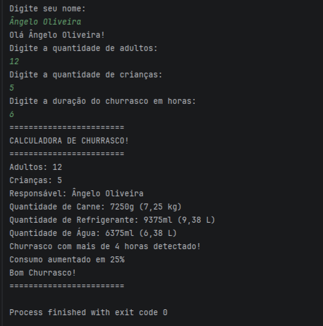

# 🍖 Calculadora de Churrasco

Uma aplicação desenvolvida em **Java** para calcular automaticamente a quantidade ideal de carne, refrigerante e água para um churrasco, considerando o número de adultos, crianças e a duração do evento.

## 📸 Demonstração



## 🚀 Funcionalidades

* Calcula a quantidade de carne necessária.
* Calcula a quantidade de refrigerante necessária.
* Calcula a quantidade de água necessária.
* Ajusta automaticamente o consumo conforme a duração do churrasco:

  * Mais de **4 horas** → aumento de **25%**.
  * Mais de **6 horas** → aumento de **50%**.
* Exibe os resultados em **gramas/ml** e também em **kg/litros**.

## 🛠️ Tecnologias Utilizadas

* Java
* IntelliJ IDEA
* Git
* GitHub

## 📚 Conceitos Praticados

* Manipulação de variáveis
* Estruturas condicionais
* Conversão entre tipos numéricos
* Formatação de números decimais
* Organização de projetos Java
* Versionamento com Git
* Publicação de projetos no GitHub


## ▶️ Como executar

1. Clone este repositório:

   ```bash
   git clone https://github.com/Angelooliveiraz/calculadora-churrasco-java.git
   ```

2. Abra o projeto em uma IDE Java (como IntelliJ IDEA ou Eclipse).

3. Execute a classe `CalculadoraChurrasco` (ou `ProjetoCalculadoraChurrasco`, caso ainda não tenha renomeado).

4. Informe:

   * Nome do responsável
   * Quantidade de adultos
   * Quantidade de crianças
   * Duração do churrasco

5. O programa exibirá automaticamente a quantidade recomendada de carne, refrigerante e água.

## 🎯 Objetivo

Este projeto foi desenvolvido para praticar conceitos fundamentais da linguagem Java e fortalecer a lógica de programação por meio de um problema do cotidiano.


